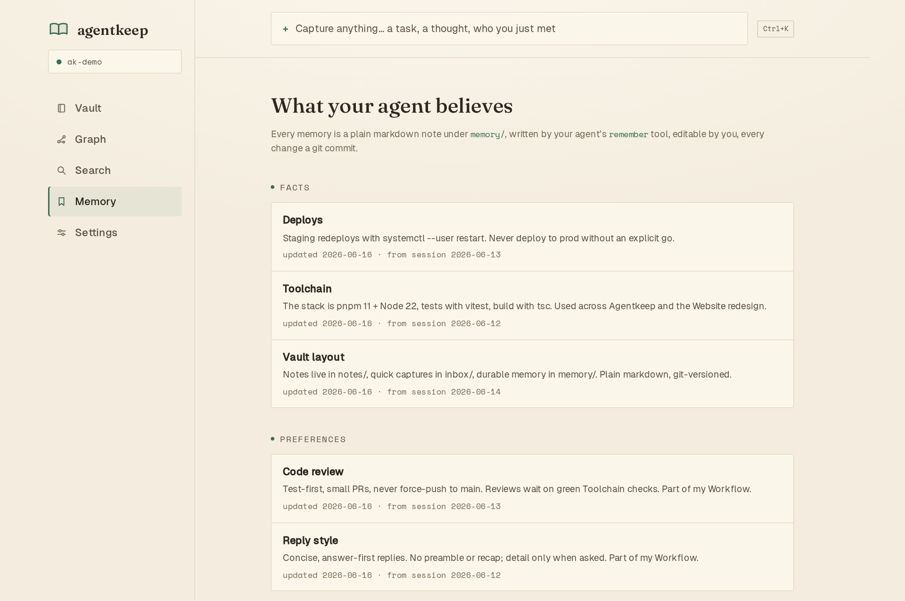
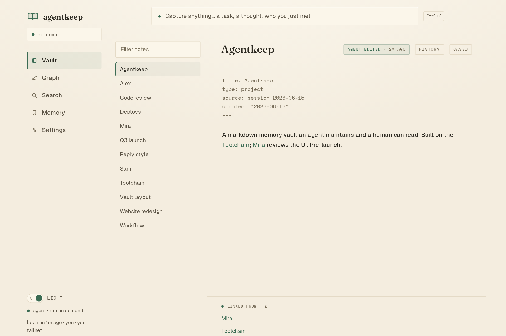
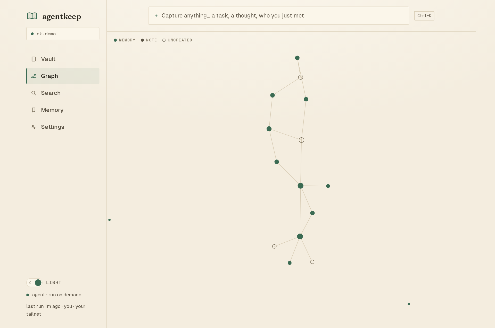
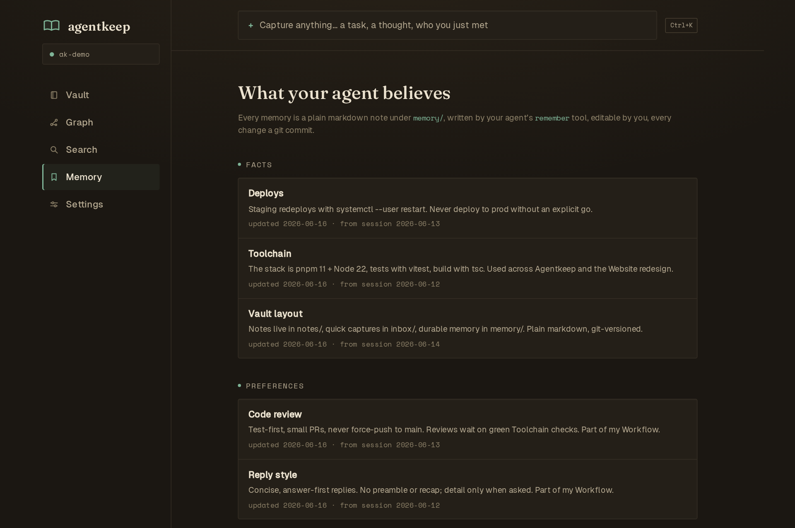

<div align="center">

<picture>
  <source media="(prefers-color-scheme: dark)" srcset="docs/banner-dark.png" />
  
</picture>

<p>
  
  
  
  
  
</p>

**Your agent's memory, as a vault you can read.**

A self-hosted, MIT, Obsidian-compatible markdown vault for agent memory:
plain files your agent can write, and you can open, inspect, correct, and version with git.

</div>

<br/>



<br/>

## What it is

Agentkeep is plain-file memory for the agent you already run.

Your agent writes through MCP. Agentkeep saves durable memory under `memory/`, captures raw thoughts under `inbox/`, renders Memory and Graph views, and commits governed edits to git. Raw file-only agents can still write markdown, but they skip the protected MCP/web write path.

Agentkeep is deliberately not a recall engine. It does no embeddings, no recall ranking, and ships no model or API key. Your connected agent does the reasoning. Agentkeep stores and shows what it believes so you can read, trust, and correct it.

## Why

Agent memory is useful only if you can inspect it.

Most memory becomes a black box: stale facts, wrong preferences, duplicate project notes, and no clear way to fix them. Agentkeep makes memory a vault of plain markdown. Your agent can keep the vault, but you own the files and the history.

## A look around

<p align="center">
  
  
</p>

The home screen is the vault: note list, raw markdown editor, live `[[wikilinks]]`, backlinks, autosave, provenance, and undo for agent edits. Graph maps every indexed note and unresolved link, with memory notes highlighted.

A warm reading room in light and dark:



## How it works

One vault, two drivers: your agent writes through MCP, you read and correct through the web app or plain files.

1. **Connect your agent.** Point any MCP client, or any file-capable agent, at the vault.
2. **It writes memory.** Durable facts, preferences, people, and projects land as markdown via `remember`; quick captures land in `inbox/`.
3. **You review it.** Open Memory to see what your agent believes, edit stale or wrong notes, and follow links through the graph.

Every MCP/web write goes through a content-hash compare-and-swap, cross-process lock, atomic write, and git commit. Governed writes do not silently clobber each other, and every change is reversible with `git revert` or in-app undo. File-only writes are ordinary filesystem edits; use them for raw access, and prefer MCP when you want attribution and conflict protection.

## Features

- **Plain markdown, Obsidian-compatible.** `[[wikilinks]]`, backlinks, YAML frontmatter, and existing Obsidian vaults work as-is.
- **Readable memory.** The Memory page shows "What your agent believes," grouped as facts, preferences, people, projects, or untyped notes.
- **Capture inbox.** Drop quick thoughts into `inbox/`; your agent can file them into memory, notes, or tasks later.
- **Force-directed graph.** See the whole vault, unresolved links, and memory clusters.
- **Obsidian-friendly editor.** Live preview, link completion, backlinks, note history, and guarded memory correction.
- **Safe two-driver editing.** CAS, atomic writes, git commits, and structured MCP errors keep agent and human edits legible.
- **Bring your own agent.** Agentkeep has no API key of its own; your connected agent does the reasoning over MCP.
- **Local and self-hosted.** No app telemetry, installable PWA, localhost by default, optional Tailscale exposure.

## Quickstart

Start from the checkout when you want the web app. Requires Node 22+ and pnpm.

```bash
git clone https://github.com/victorv2i/agentkeep
cd agentkeep
pnpm install
pnpm -w build          # builds the core + agentkeep / agentkeep-mcp bins

# create a fresh vault, or point at an existing Obsidian vault
node dist/bin/agentkeep.js init ~/MyVault

# optional: seed fictional demo memory for a non-empty first run
node dist/bin/agentkeep.js demo ~/MyVault   # same subcommand as: agentkeep demo ~/MyVault

# run the web app
node dist/bin/agentkeep.js open ~/MyVault                # http://localhost:3000
node dist/bin/agentkeep.js serve ~/MyVault --tailscale   # plus your tailnet
```

The published `@agentkeep/core` package contains the core library, MCP server, and bins. It does not bundle the web app; use this git checkout for `open` / `serve`. If those web commands are run from an npm-only install, they fail with checkout instructions instead of pretending the web app is present. `agentkeep-mcp <vault>` still works from npm.

`open` serves on localhost only. To reach Agentkeep from other devices, run `serve --tailscale` and let the tailnet be the auth boundary. The web app has no login of its own, so never expose the raw port on an untrusted network. On normal exit, `serve --tailscale` removes its HTTPS 443 route; after a hard kill, clean up with `tailscale serve --https=443 off`.

`open` works on an existing Obsidian vault as-is. It installs as a PWA (add to home screen). There is deliberately no service worker, because a live vault should never serve stale offline state.

## Connect your agent

Point the agent you already run at the vault.

`Settings > Connect` in the app generates copy-paste config with your real vault path and command. The common shapes are:

**Any MCP client** (YAML `mcp_servers` shape):

```yaml
mcp_servers:
  agentkeep:
    command: agentkeep-mcp
    args: ["/path/to/vault"]
```

**Any MCP client** (JSON `mcpServers` shape):

```json
{
  "mcpServers": {
    "agentkeep": {
      "command": "agentkeep-mcp",
      "args": ["/path/to/vault"]
    }
  }
}
```

**Any file-only agent:** read and write markdown in the vault folder. This is raw filesystem access: no content-hash guard, no automatic Agentkeep git attribution, and no MCP tool error values. The web app re-indexes external markdown changes while it is running. The frontmatter and folder conventions are in [`SPEC.md`](./SPEC.md).

Then hand your agent the memory-keeper routine in [`AGENT-ROUTINE.md`](./AGENT-ROUTINE.md), a paste-in system prompt or skill. After each session, or on a schedule, it stores durable memory with `remember`, files the inbox, and wikilinks notes into the graph using only the nine MCP tools.

## MCP tools

`agentkeep-mcp <vault-path>` serves nine tools over stdio. Writes use the governed write core.

`search` · `read_note` · `write_note` · `list_notes` · `list_tasks` · `get_backlinks` · `capture` · `remember` · `delete_note`

Failures return structured MCP tool errors with `{ error, code }`. See [`SPEC.md`](./SPEC.md) for the full tool and file reference.

## Security

Agentkeep is local, single-user software with no auth wall by design. Run it on `localhost` or a private tailnet only; anyone who can reach the web app can read and write the active vault. See [`SECURITY.md`](./SECURITY.md).

## Contributing

Small, tested, factual patches are welcome. Do not include secrets or private vault data. See [`CONTRIBUTING.md`](./CONTRIBUTING.md).

## Develop

```bash
pnpm test
pnpm typecheck
pnpm --filter @agentkeep/web typecheck
pnpm --filter @agentkeep/web build
```

## License

MIT.